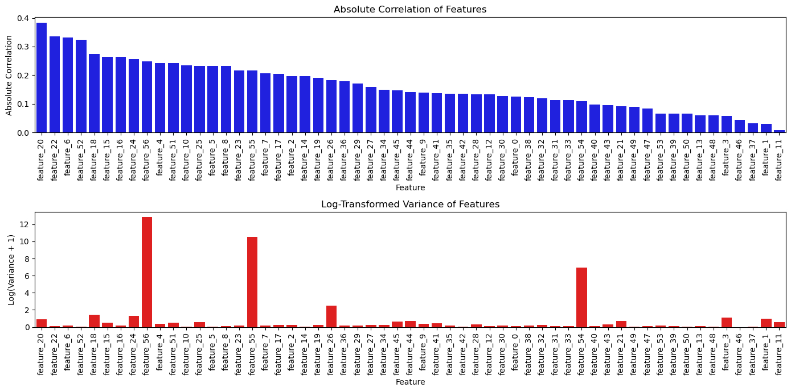

# Spam Email Classification

A data mining project investigating spam email classification using the UCI Spambase dataset. The project implements and compares four machine learning algorithms — K-Nearest Neighbors, Decision Tree, Linear SVM, and Logistic Regression — and examines the effect of reducing the feature set on classification performance and computational cost.

## Overview

The goal of this project is to classify emails as **spam** or **non-spam** based on numerical features extracted from their content.

The project addresses two main questions:

1. How do different classification algorithms perform on the spam classification task?
2. How does reducing the feature space affect classification performance and computational cost?

Each algorithm is evaluated twice:

* Using all 57 input features
* Using only the features retained by the feature-selection procedure

The classification algorithms are implemented directly in the notebook, while scikit-learn is used for utilities such as data splitting, cross-validation, feature standardization, and evaluation.

## Dataset

The project uses the **UCI Spambase dataset**, which contains 4,601 email instances with 57 input features and a binary target indicating whether an email is spam.

The features describe characteristics of email content, including:

* **48 word-frequency features**
* **6 character-frequency features**
* **3 capital-letter statistics**

  * Average length of uninterrupted capital-letter sequences
  * Longest uninterrupted capital-letter sequence
  * Total number of capital letters

The dataset is not included in this repository. It can be obtained from the UCI Machine Learning Repository:

**UCI Machine Learning Repository — Spambase**

## Methodology

### 1. Exploratory Analysis

The dataset is examined to understand the distribution and characteristics of the input features.

For each feature, the project calculates:

* Pearson correlation with the target
* Feature variance

These statistics are used to investigate the relationship between the features and the spam label.

### 2. Feature Selection

A statistical heuristic is used to reduce the feature space.

A feature is retained based on:

* Its absolute correlation with the target
* Its variance relative to the other features

The correlation threshold is set to **0.1**, while the variance threshold is based on the **25th percentile of feature variances**.

This approach is used as a practical feature-filtering heuristic rather than as a definitive measure of whether a feature contains useful predictive information.



### 3. Train/Test Split

The dataset is divided into:

* **70% training data**
* **30% test data**

using a fixed random state of 42.

Five-fold cross-validation is used to select the main hyperparameter for each algorithm.

### 4. Classification Algorithms

#### K-Nearest Neighbors

A KNN classifier is implemented from scratch using Euclidean distance and inverse-square distance weighting.

The number of neighbors is selected from **1 to 30** using five-fold cross-validation.

#### Decision Tree

A decision tree classifier is implemented from scratch using recursive splitting.

The maximum tree depth is selected from **1 to 13** using five-fold cross-validation.

#### Linear SVM

A soft-margin linear Support Vector Machine is implemented from scratch using gradient-based optimization.

The input features are standardized before training.

#### Logistic Regression

A logistic regression classifier is implemented from scratch using gradient descent.

The learning rate is selected from:

`0.01, 0.05, 0.1, 0.5, 1`

using five-fold cross-validation.

## Results

### All Features

The following results were obtained using all 57 input features:

| Algorithm           | Training Time (s) | Testing Time (s) | Test Accuracy |
| ------------------- | ----------------: | ---------------: | ------------: |
| KNN                 |             0.000 |            1.864 |    **92.47%** |
| Decision Tree       |             9.801 |            0.010 |        91.09% |
| Linear SVM          |            62.413 |           0.0004 |        92.11% |
| Logistic Regression |             0.212 |           0.0003 |        92.11% |

### Selected Features

The same algorithms were evaluated using only the features retained by the feature-selection heuristic:

| Algorithm           | Training Time (s) | Testing Time (s) | Test Accuracy |
| ------------------- | ----------------: | ---------------: | ------------: |
| KNN                 |             0.000 |            1.058 |    **91.38%** |
| Decision Tree       |            20.507 |            0.008 |        90.58% |
| Linear SVM          |            27.718 |           ~0.000 |        89.86% |
| Logistic Regression |             0.084 |           ~0.000 |        90.51% |

## Observations

Reducing the feature set resulted in a **small decrease in test accuracy for all four algorithms**.

The reduced feature set also improved measured computational efficiency for several algorithms, particularly KNN, Linear SVM, and Logistic Regression. However, this effect was not uniform; for example, the measured training time of the custom Decision Tree implementation increased from 9.801 seconds to 20.507 seconds.

Overall, the experiments illustrate a trade-off between **predictive performance and computational cost**.

An important limitation is that features excluded by the selection procedure should not be interpreted as inherently useless. The selection method is based on individual correlation and variance statistics, which may not capture nonlinear relationships or interactions between features.

## Key Results

* KNN achieved the highest observed test accuracy in the all-feature experiment: **92.47%**.
* Linear SVM and Logistic Regression both achieved **92.11%** using all features.
* The feature-selection heuristic reduced test accuracy for all four algorithms.
* The reduced feature set improved measured computational cost for several models.
* The results demonstrate a trade-off between dimensionality, computational cost, and predictive performance.

## Repository Structure

```text
spam-email-classification/
├── spam_email_classification.ipynb
├── figures/
│   ├── feature_selection.png
│   ├── results_all_features.png
│   └── results_selected_features.png
├── README.md
├── requirements.txt
└── .gitignore
```

## Running the Project

### 1. Install Dependencies

```bash
pip install -r requirements.txt
```

### 2. Obtain the Dataset

Download the Spambase dataset from the UCI Machine Learning Repository.

The dataset itself is not included in this repository.

### 3. Open the Notebook

Open:

```text
spam_email_classification.ipynb
```

The notebook contains the complete data analysis, feature selection procedure, algorithm implementations, cross-validation, experiments, and visualizations.

Before running the notebook, update the dataset file path to point to your local copy of `spambase.data`.

## Technologies

* Python
* NumPy
* Pandas
* Matplotlib
* Seaborn
* Scikit-learn
* Jupyter Notebook
